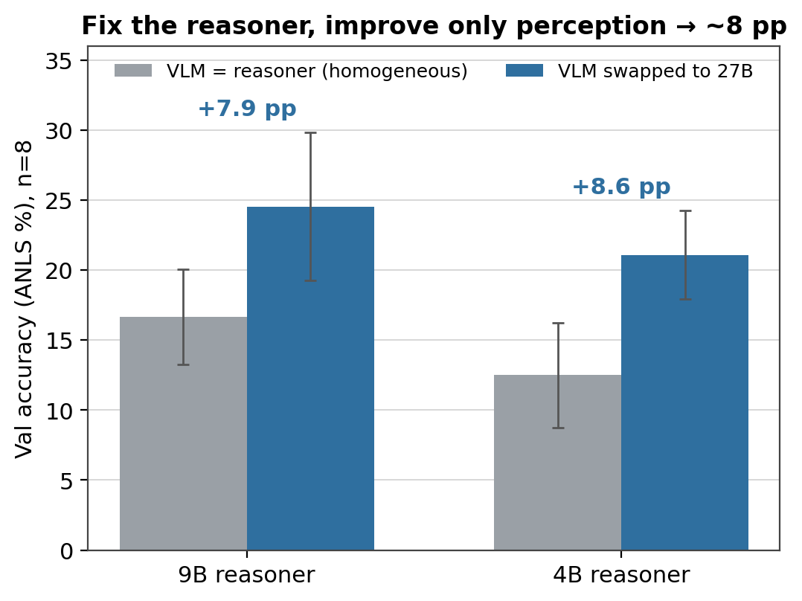

[Code: github.com/bdsaglam/docvqa](https://github.com/bdsaglam/docvqa){.more}

> **TL;DR.** We jointly won the ICDAR 2026 DocVQA challenge in the 8–35B tier. An
> open Qwen 3.5 27B beat the challenge's bare-model baselines, Gemini 3 Pro and
> GPT-5.2, on the held-out test set, with no fine-tuning. Our approach is a Python
> REPL plus a single perception tool: a vision model the reasoner points at any
> region of any page. So it decides where to look, instead of reading whole pages at
> a fixed resolution. Two parts carry the accuracy, and only together: the REPL and
> the perception call. The usual additions do nothing for accuracy. That includes a general
> sub-agent, clever trajectory management, and the OCR and search our competition
> entry used. The reason is simple. For a model this size, document VQA is bound by
> perception budget, not reasoning. The model answers fine once it can see the
> evidence; it just can't resolve a dense page in one look. The approach builds on
> Recursive Language Models, CodeAct, and the code-as-vision line. What this post
> adds is putting them together for documents and pinning down which parts carry the
> result.

## A 27B model, a Python REPL, and one question

We entered the ICDAR 2026 DocVQA challenge with an approach, not a model: let a
code-capable model direct its own perception from inside a Python REPL. The model we
plugged into it was an open Qwen 3.5 27B. At its core the system is two things: the
REPL, and an on-demand call to a vision model, used as a perception tool the reasoner
invokes region by region. The entry was a joint winner of the 8–35B tier,
on a genuinely hard document benchmark.

Winning is a nice anchor, but the sharper question is where the lift comes from.
That a code harness helps a model is by now well established; what's less clear is
which of its pieces (the REPL, the VLM tool, the agent loop) is actually carrying
the result. So this post takes the thing apart, one piece at a time: **which
components carry the win, and which are just along for the ride?**

The answer is useful in a specific way: the core that does the work is smaller than
what most people build. Two parts matter; the rest (a general sub-agent, clever
trajectory management, an OCR pipeline) barely move accuracy. And underneath sits
a reframe worth keeping if you build multimodal agents: on documents the bottleneck
is **perception budget, not reasoning.** The model usually isn't too weak for the
page; it just can't afford to see all of it at once.

But first, the result that makes the tear-down worth doing.


## The result

We were a **joint winner of the ICDAR 2026 DocVQA challenge in the 8–35B parameter
tier** with Qwen 3.5 27B, an open model, and no fine-tuning.

The challenge scores a held-out test set, with self-consistency voting over a
handful of samples (the rules allow it). Two of the entries below are ours: the
tuned one that topped the tier, and the streamlined general method this post
describes. Both clear the challenge's official baselines. Those baselines are bare
models, reported with no agentic scaffold, so the fair reading is a harnessed 27B
against unharnessed frontier models.

| System (held-out test set) | Score |
|---|---|
| **Qwen 3.5 27B (ours), tuned entry** | **43.8%** |
| **Qwen 3.5 27B (ours), general method** | **39.4%** |
| Gemini 3 Pro | 37.5% |
| GPT-5.2 | 35.0% |
| Gemini 3 Flash | 33.8% |
| GPT-5 Mini | 22.5% |

The **tuned entry** scored higher because it was fitted to this benchmark:
DocVQA-specific prompts, plus the OCR and search we spend the post stripping away.
The **general method** drops all of that and still clears the frontier. Specializing
buys a few points of peak score; generalizing gives them back. This post is about
the general one.

One more honest note: these test numbers sit below our validation numbers. We read
most of that gap as overfitting. We developed and tuned against the validation set,
so some fit to it is unavoidable, and we don't claim the validation figures transfer
untouched to test.

Either way, the takeaway isn't the leaderboard position. It's *how* the score was
reached. A lot of strong document-QA systems get there by fine-tuning on tens of
thousands of question-answer pairs, or by building a specialized OCR-and-encoder
pipeline. The general method needs neither. The model is stock Qwen 3.5 27B, and the
system is a REPL and one perception call.
That's the part worth keeping:

> **On this task, harness design substituted for fine-tuning.** Before you reach
> for training data or a specialized pipeline, it's worth seeing how far a general
> model gets when you let it direct its own perception.

But first: what makes this task hard enough to need a system like that?


## The task, and why it's hard

Document visual question answering is what it sounds like: you're handed a document
and a question in plain language, and you have to answer it. The catch is what
counts as a "document." In the ICDAR 2026 DocVQA challenge a single item might be a
one-page infographic or a 280-page annual report, and the answer might be a value
in a merged table cell, a label on an engineering drawing, a figure on a crowded
chart, a date in a form, or something you only get by reading two pages and doing
arithmetic.

So before any reasoning happens, there's a *finding* problem, and it runs along two
axes at once. **Across pages:** the evidence lives on one of up to 280, so you have
to find the right page first. **Within a page:** the page itself can be *large*
(thousands of pixels on a side) and *dense* (a crowd of labels, cells, and lines),
so the answer occupies a tiny fraction of it, well below what a single
fixed-resolution read can resolve. Locate the page, then the region on it, *then*
read, often compositing or computing over what you found. That's the part
general-purpose vision-language models struggle with: hand a VLM all the pages at
once and it reads each at a fixed resolution with a fixed slice of attention. On a
sparse page that's fine. On a large, dense one it isn't.

The scale of the finding problem is easy to miss. Across the challenge, documents
run from a single page to 281, with a median of 8. Most are short. A long tail is
not.


**Figure 1.** Document length across the DocVQA-2026 validation and test sets. Page
counts span 1 to 281, so before reading anything the agent often has to find the
right page among dozens or hundreds.

That gap, between what's on the page and what a single read can resolve, is the
whole game. The question is what to do about it. The obvious moves are to use a
bigger model or to stuff more pages into the context window. The move that actually
worked was to let the model decide *where to look*.


## The recipe

The whole method fits in one sentence. Give a code-capable model a persistent
Python REPL and a single perception primitive (an on-demand call to a VLM,
pointed at any region of any page), and let it *direct* perception instead of
swallowing the document whole. It can crop to the evidence, zoom for acuity, sweep
pages in a loop, composite regions, and do in code the coordinate math and
arithmetic a VLM is bad at. Perception becomes something the model spends
deliberately, a region at a time, rather than a single fixed gulp of pixels. Three
moves give the system its name, **Perceive-Reason-Code**: perceive through a VLM
call, reason in language, act by writing code. Unless noted otherwise, every
experiment below uses Qwen 3.5 27B as both the reasoner and the VLM, on the
DocVQA-2026 validation set (25 documents, 80 questions), eight trials, scored by
ANLS (the fuzzy string-match metric DocVQA uses), reported as mean ± std.


**Figure 2.** Left: the active-perception loop. The reasoner writes code, the
code calls a (frozen) VLM against a chosen crop, the text it returns flows back
into the REPL as the next observation. Right: a ReAct agent (tool calls, no code
environment) with the same VLM but no REPL. It calls the tool and gets a text observation back, but only for whole
pages, with no way to crop, compose, or compute. The REPL is the only structural
difference between them, and it's what converts reasoning into targeted perception.

Concretely, the loop is the familiar agent shape: a **state** (the transcript so
far), an **action** (a block of Python the model writes), and an **observation**
(whatever that code prints, including the text a perception call returns). Hold
onto that framing; how the state is represented turns out to matter later, in a
way that doesn't affect accuracy at all.

Here is one run of the loop on a real question: the gap between two values on a
chart buried in a 181-page report.


**Figure 3.** One run of the loop (16 iterations, correct). The reasoner-LM writes
Python that calls the frozen VLM on regions it chooses. It surveys ten candidate
pages in one batched call, locates the table via a table-of-contents pointer, and
reads page 76 whole, getting a wrong number ($978.42). It distrusts that, crops to
the chart band and re-reads ($2,287.07), which disagrees; it adjudicates by reading
the region in halves, then does the subtraction in Python, where it's exact.

The actions are Python the model writes, the crop-and-verify catches a wrong number
a single read would have submitted, and the arithmetic happens where it's exact
rather than in the VLM's head.

One setup detail, since a careful reader will ask: these runs disable the model's
native "thinking" channel.[^think] That doesn't make the agent reason less. It
relocates the reasoning into the visible body of each turn, where the code and the
comments are. Thinking-off is not answering-without-reasoning; it just moves the
reasoning somewhere we can see it.

### Where this comes from

Perceive-Reason-Code stands on a few well-tested ideas. The REPL-with-a-sub-call
shape comes from **Recursive Language Models** (Zhang et al., 2025): the model works
inside a code environment where the document is just a variable it can slice and
inspect with code, and it can fire off a sub-call to a model when it needs one.
Writing actions *as code* rather than as JSON tool calls is **CodeAct**.
Orchestrating vision modules with a program goes back to **VisProg** and
**ViperGPT**. The move here is to put them together for documents, with the sub-call
specialized as visual perception. (When the same model serves as both reasoner and
VLM, that perception call is the model calling itself. But nothing here turns on
that. It's one perception primitive the reasoner invokes as often as it needs, and
that's how we'll treat it.)

RLM had already shown, for *text*, that the REPL alone lifts a baseline and a
sub-call lifts it further. The question this post answers is whether that holds when
the sub-call is a *VLM* over a stack of document images. More usefully: which
piece is actually responsible. The rest of the post is the controlled answer.

[^think]: We run with `enable_thinking=false` for cost and reproducibility.
Re-enabling it doesn't change the picture (a separate ablation moves it less than
the trial-to-trial noise).


## The model axis: does it generalize?

The win used Qwen 3.5 27B, but nothing in the recipe is specific to it. To check,
we run the harness homogeneously (the same model as both reasoner and VLM) across
sizes and across a second family.

| Model (reasoner = VLM) | ReAct (no REPL) | RLM (`rvlm`, ours) | CodeAct twin |
|---|---|---|---|
| Qwen 3.5 4B | 11.9 | 12.5 | 16.3 |
| Qwen 3.5 9B | 15.0 | 16.7 | 23.0 |
| Qwen 3.5 27B | 27.2 | **41.9** | 39.5 |
| Gemma 4 31B | 18.4 | 32.5 | 30.3 |
| Gemma 4 E4B | 6.1 | 7.3 | 7.7 |

The code-REPL harnesses (RLM and its CodeAct twin) beat the no-REPL ReAct agent at
every capable size, and the margin scales with model capability: a point or two at
4B, about fifteen points at Qwen 27B and Gemma 31B. But the lift has a floor. Gemma
4B (E4B) sits below the capacity gate: no harness clears the no-scaffold baseline
(around 6), because the model cannot write the code to drive the loop. The harness
amplifies a capable model; it cannot rescue one that cannot code.

So the lift is a **capacity gate**, not a free lunch. It generalizes across sizes
and across a second family, for any model that is a strong enough multimodal coder.
Qwen 3.5 27B is simply the checkpoint we entered in the challenge. The recipe is
about the harness, not the model.


## The dataset axis: document length

Document length is an axis of its own, and it separates the methods cleanly once
documents get long. To see it, run the main
solvers (no ablations) on two benchmarks of very different length: MP-DocVQA (short,
at most 20 pages, mean 5.3, scored by ANLS, the fuzzy string-match metric DocVQA
uses) and MMLongBench-Doc (long, around 47
pages, scored by a Qwen judge). Both on stratified-random subsets, n=3, Qwen 3.5
27B.


**Figure 4.** Across two benchmarks of very different length, the active-perception
advantage over a raw multi-image baseline widens from a few points on short documents
to tens of points on long ones. Qwen 3.5 27B, n=3, mean ± std.

On MP-DocVQA the active-perception method scores 61.8 and the raw multi-image
baseline 58.1 (the same no-scaffold baseline from the ablations, the 20.9% "raw
multi-image" cell), a gap of about 4 points (roughly 2 to 6 across the runs). On
MMLongBench-Doc the active-perception method scores 66.6 and the raw multi-image
baseline 24.2, a gap of about 42 points (roughly 13 to 42).

The mechanism is visible in how each method moves across the axis. The recursive
methods stay flat (around 62 to 67%), because they navigate the document regardless
of length. The raw multi-image baseline degrades. Its "Unknown" rate (the questions where it
cannot find the evidence) climbs from about 22% on short documents to about 87% on
long ones, as the evidence falls off the end of a fixed page budget.

The point is about where the scaffold earns its keep. On the moderate DocVQA-2026
documents its edge over a strong baseline is modest, because most pages fit the
budget. The edge is largest exactly where documents are long, which is where you
would actually reach for it.


## Ablations: what carries the lift

The harness has a few moving parts: a Python REPL, a VLM that the agent calls as a
perception tool, and the loop that ties them together. Which of those is doing the
work? The clean way to find out is to remove one part at a time and watch the
score move. Every run keeps the same answer-formatting rules; only the structure
changes.

Start at the top and take away the REPL. What's left is a **ReAct agent**: the
same VLM perception tool, but called through plain tool-use instead of from inside
a code environment. The score falls from **41.9%** to **27.2%**, about fifteen
points. Without a REPL the agent can't crop a region by arithmetic, can't tile a
page, can't subtract two numbers it just read; it asks for whole pages and stops
early (around five steps per question). The REPL isn't a convenience. It's the
thing that lets reasoning turn into *targeted* perception.

Now do the opposite: keep the REPL, take away the perception *call*. Give the
agent a `display()` that loads the page pixels straight into its own context, so
it looks at the document itself instead of asking a focused VLM call to look and
report back. This collapses too, down to **22.3%**. The agent also thrashes: it
runs 30+ steps per question and pins the iteration cap on most of them, grinding
without converging.

That second result is exactly what the Recursive Language Models line would
predict. Stuffing raw content into the reasoner's own context degrades it (the
familiar context-rot effect, where a model handles a long or noisy context worse
than a clean one), whereas a focused sub-call that returns *compact text* keeps the
context clean. RLM tells this story for long text; here it shows up for pixels, and
it's what pins down *which* half does the work. Having a REPL isn't enough on its
own; the perception has to go through **a call that returns text**,
not be poured into the reasoner's own window. (The RL-trained version of "let the
model look at its own image crops" is DeepEyes;[^deepeyes] the point here is only
that a *prompted* REPL agent is better off not.)

Put the two knockouts together and you get a clean 2×2:

| | **with active-perception call** | **without (pixels in-context / none)** |
|---|---|---|
| **with REPL** | **41.9%** (full method) | 22.3% (`display()` only) |
| **without REPL** | 27.2% (ReAct) | 20.9% (raw multi-image, no scaffold) |

You need both halves; neither alone gets you far. Drop either and you
land in the low-to-mid 20s, near the no-scaffold baseline. The lift lives in the
combination: a code REPL **and** an on-demand VLM perception call.


**Figure 5.** The full configuration space, eight trials each. Three tiers
separate cleanly: REPL + active perception (~36–42%), missing one of the two
(no REPL, or no perception call, 21–27%), and an OCR-only floor (the OCR knockout
below). Every cross-tier gap is much larger than the per-cell spread.

### Three things that turn out *not* to matter

The core is small, and the obvious ways to enrich it don't make it any bigger.
That's the more useful half of the story, because it's what tells you what you
*don't* need to build.

**Generalizing the call buys nothing.** We replaced the focused "look at this
region" call with a general sub-agent that could take on any subtask (image
optional). Accuracy didn't move: **36.7%**, inside the noise of the full method.
And when we logged what the agent actually asked the sub-call to do, about **99%**
of the calls were still plain perception. One focused perception primitive already captures the
benefit; the extra generality just sits there. (We use one level of perception call
throughout; we never tried stacking them deeper.)

**The trajectory format doesn't matter, for inference.** Our agent compacts its
history as it goes (the RLM style). Its twin keeps an **append-only** transcript
instead, never compacting, the CodeAct style, a fully-observable log of every
turn. The two tie: **39.5%** vs 41.9%, within a couple of points, and the
append-only version doesn't even lose ground on longer documents (the per-document
gap is uncorrelated with page count). For getting the answer, how you represent
the trajectory is a wash.

It does, though, matter for something else: **training**. If you ever want to
*train* the agent (with reinforcement learning, or by distilling a stronger one),
the methods assume the model's output grows as a clean prefix. Turn *t* is just
turn *t−1* with more appended. Compaction breaks that: it rewrites the history
between turns, so the sequence is no longer a growing prefix. The append-only
transcript keeps it, which makes it the more *trainable* of the two. And, as we
just saw, choosing it costs nothing in accuracy. (Making compacted trajectories
trainable anyway is its own open problem; FoldAct is an early attempt.[^foldact])
We'll come back to this at the end.

**Adding OCR on top buys nothing here.** Bolt OCR page text and a BM25 search tool
onto the full method and the score is **36.6%**, flat, within the noise. On these
moderate-length documents, text retrieval adds nothing the active-perception call
isn't already getting from the pixels.

So the core that matters is small: **a REPL plus one active-perception call.**
Generality, trajectory format, and OCR-on-top are all dispensable. If you were
going to build this, you'd build less than you think.

That leaves one more knockout, the one that says what kind of problem this is.

**Swap the eyes for a text channel.** Give the same REPL agent the OCR transcript of
every page plus a search tool, and no vision at all. It falls to **14.7%**, the
lowest score in the study, below even the no-scaffold competition prompt. On
layout-bound categories (engineering drawings, maps) it scores zero out of ten in
all eight trials. For these questions, OCR text cannot stand in for looking.
Perception is not optional; it is the thing the scaffold is buying.

### The full table

Every configuration, with its single-trial mean, oracle ceiling (pass@8), and
self-consistency vote (SC@8) over the eight trials:

| Configuration | avg@1 (± std) | pass@8 | SC@8 |
|---|---|---|---|
| **Active perception (full)** | **41.9 ± 5.8** | **68.8** | **47.5** |
| Append-only twin | 39.5 ± 2.8 | 63.8 | 45.0 |
| + general sub-agent | 36.7 ± 2.8 | 66.3 | 41.3 |
| + OCR & search | 36.6 ± 2.9 | 67.5 | 40.0 |
| ReAct (no REPL) | 27.2 ± 3.2 | 53.8 | 32.5 |
| Raw multi-image (no scaffold) | 20.9 ± 1.6 | 27.5 | 20.0 |
| Competition prompt (no scaffold) | 18.9 ± 1.9 | 33.8 | 21.3 |
| OCR-only (no vision) | 14.7 ± 2.2 | 27.5 | 15.0 |

Two things to note. Self-consistency (SC@8) buys a few points over a single trial,
which is why the competition submissions vote. And the oracle ceiling sits far above
single-trial accuracy on the strong scaffolds: pass@8 is 68.8 against an avg@1 of
41.9, and 63.8 against 39.5 for the trainable append-only twin. The right answer is
reachable much more often than it is reliably produced, and the last section picks
up that gap.

[^deepeyes]: Zheng et al., *DeepEyes: Incentivizing "Thinking with Images" via
Reinforcement Learning*, arXiv:2505.14362.

[^foldact]: Shao et al., *FoldAct: Efficient and Stable Context Folding for
Long-Horizon Search Agents*, arXiv:2512.22733.

### Is it perception or reasoning?

The knockouts pin the scaffold's contribution to perception. To separate
perception from reasoning directly, we vary each in turn and watch the score.
Start by holding the reasoner fixed and changing only the eyes. Take a smaller model
as the reasoner and feed its perception calls to progressively better VLMs, ending
at the 27B. The reasoner never changes; only the quality of what it can see does.
Accuracy climbs about **eight points** at both sizes we tried: +7.9 with a 9B
reasoner, +8.6 with a 4B one, both well outside the noise.[^stats] Same brain,
better eyes, large lift: that's the signature of a perception bottleneck, not a
reasoning one. (And it cuts the other way too: a stronger reasoner writes
better-targeted perception queries and gets more out of even a weak VLM. ReAct has
no such actuator. Its ceiling is whatever a whole-page read resolves, and a smarter
reasoner can't aim it.)



**Figure 6.** Hold the reasoner fixed and swap in a stronger (27B) perception
backend, and accuracy jumps about eight points at both reasoner sizes (4B and 9B
reasoners). The signature of a perception bottleneck.

Now do the opposite: hold the VLM fixed at the 27B backend and vary the reasoner.
The active-perception agent scores 42% at 27B, 25% at 9B, 21% at 4B, beating ReAct
at every size.

| reasoner (VLM = 27B) | active perception | ReAct (no REPL) |
|---|---|---|
| 4B | 21 | 16 |
| 9B | 25 | 21 |
| 27B | 42 | 27 |

The reasoner clearly matters, and the jump from 9B to 27B (+17pp) is even larger
than the VLM swap.

If perception is the real story, the advantage should be largest where a page packs
the most fine detail, and it broadly is. The per-category gap between the
active-perception agent and the ReAct baseline tracks visual density:


**Figure 7.** The active-perception advantage over ReAct, by document category.
Biggest on dense, structured pages where cropping recovers fine detail: engineering
drawings (+36), business reports (+30), infographics (+19). Smallest on text-linear
pages like science papers (+4) and slides (+1), where a single read already gets
most of the page. (Maps are a hard case for every configuration, so the *advantage*
there is modest even though the pages are busy.) The ranking is the point, not the
exact values.

The advantage concentrates where a page packs fine detail.[^length]

So is the bottleneck perception or reasoning? What we can show cleanly is that the scaffold's contribution is perceptual. Hold the models fixed and swap whole-page ReAct for active perception, and accuracy jumps from 27% to 42%, with nothing changing but how perception is spent. The reasoner matters too, and in raw points more: shrink it and accuracy falls further than swapping the VLM does. But a bigger reasoner in this loop is also a better perception-director. It writes tighter crops and better code, and it has to be a competent coder to drive the REPL at all. Much of its lift plausibly flows through perception rather than around it, though no experiment here separates sharper aiming from sharper reasoning over the evidence. The honest read is that these models are at least as perception-bound as reasoning-bound. They can reason about the answer once they can see it. What they cannot do is resolve a dense page in one look.

[^stats]: +7.87pp at 9B (Welch *t* = 3.54, 95% CI [+3.4, +12.3]) and +8.60pp at 4B
(*t* = 4.96, 95% CI [+5.2, +12.0]), eight trials per arm.

[^length]: Within-set, the "advantage grows with page count" hypothesis doesn't
hold: on the longest documents with a strong VLM the gap is flat. Across
benchmarks of very different length, a budget effect does appear, which the
document-length section takes up directly.


## The cost of generality: it's slow

Everything good about this method (general model, no training, no domain
pipeline) is bought with one currency: **calls**. Perception happens a region at a
time, each region is a VLM call, and the calls are sequential because each one
depends on what the last one returned. The full method averages around **13 steps
per question**; the in-context-pixels variant, which never converges, runs more
than twice that and pins the cap.

| Configuration | Steps / question |
|---|---|
| Active-perception agent (ours) | ~13 |
| ReAct (no REPL) | ~5 |
| In-context pixels (no perception call) | ~30 (caps out on most questions) |
| Raw single pass (no scaffold) | 1 |

So the method trades latency and token cost for accuracy and generality. On the
heaviest documents it can run up against the model's context limit outright, and
the competition's self-consistency voting multiplies the cost several times over.
This isn't a small caveat. It's the reason you'd hesitate to put this exact
configuration in front of a latency-sensitive user.

We're not the first to hit this. MADQA makes the point sharply: an unconstrained
recursive agent can be flexible *and* ruinously expensive. In their setting one
burned on the order of 270M input tokens and several hundred dollars on a task it
then *lost* to a far cheaper retrieval agent. Flexibility has a bill attached.

It helps to be clear about what the extra steps buy, though. More steps mark a
*hard* document, not a path to a better answer. Across questions, trajectory
length is mildly *negatively* correlated with correctness. The lever is the quality
of the perception loop, not its length; grinding longer is a symptom, not a fix.

The encouraging part is that we left the obvious efficiency levers untouched.
There's clear room, we just didn't need it to make the point:

- **Cut calls with cheap retrieval.** High-quality OCR run once as preprocessing,
  plus a searchable index, would let the agent jump to the right page instead of
  sweeping, fewer perception calls for the same evidence.
- **Make each call cheaper.** The reasoner and the VLM don't have to be the same
  model. A smaller, faster, or document-specialized VLM behind the perception call
  would cut per-call cost without touching the reasoning.

And this reframes the OCR result from earlier. We found OCR-on-top buys ~0
*accuracy* on these documents. But that was never its best use. Its real payoff is
likely **efficiency**: fewer and cheaper looks, not higher scores. The clean
extension isn't "OCR to answer better," it's "OCR to answer the same, faster."

Two smaller hedges, for completeness: these ablations are validation-only, and the
cross-benchmark length effect still rests on only a few trials (n=3). Neither moves
the central picture, but it's the honest shape of the evidence.

Step back from the bill for a moment, because the REPL is really an instance of a
more general idea.


## Code as a substrate for thinking

Strip away the document-specific framing and here's what the REPL really is: a
**symbolic substrate** for a neural model. Code is the medium the model explores
in, composes in, and computes in: a place to hold and manipulate things its own
context can't. Active perception is just one instance of it: the model writes code
to *aim its own eyes*, and the code does the cropping and the arithmetic that the
network is bad at. The neural part proposes; the symbolic part executes and
remembers.

That a code substrate helps at **test time** is well established. It's the
through-line of the RLM-and-CodeAct literature, and these results add a clear
document-domain data point to it.

The question I'll end on is forward-looking. Everything here exercises the substrate
at *inference*: the weights are frozen, and the code wraps around them from the
outside. What if the symbolic substrate were part of the model *itself*, woven into
how it learns and computes, rather than bolted on as an external harness at
deployment? Not a scaffold you remove afterward, but a native faculty the model is
trained to use: to compose, to compute, to aim its own perception. That's a sharper
and more uncertain claim than "code helps agents," and it's the one I keep coming
back to.

Two things from this study make it feel concrete rather than idle. First, we
already know which form is trainable: the append-only trajectory ties the compacted
one on accuracy but keeps the clean, growing-prefix structure that learning methods
assume. And making folded trajectories trainable is itself an active problem.
Second, the oracle gap is just sitting there: for the append-only twin, pass@8 is
about 24 points above what a single trial reliably produces. That is not noise. It
is exactly the kind of signal a learning procedure exists to capture.

Whether the symbolic substrate can be made part of the model *during training* (so
that neural and symbolic computation are learned together rather than stitched
together at inference) is genuinely open. We won a competition by letting a frozen
model write code to look more carefully. The thread worth pulling next is whether
teaching a model to think *in* that substrate, as part of itself, makes the model
itself more capable.


## References

- Zhang, A. L., Kraska, T., & Khattab, O. (2025). Recursive Language Models. [arXiv:2512.24601](https://arxiv.org/abs/2512.24601).
- Wang, X., et al. (2024). Executable Code Actions Elicit Better LLM Agents (CodeAct). ICML.
- Yao, S., et al. (2023). ReAct: Synergizing Reasoning and Acting in Language Models. ICLR.
- Gupta, T., & Kembhavi, A. (2023). Visual Programming (VisProg). CVPR.
- Surís, D., Menon, S., & Vondrick, C. (2023). ViperGPT: Visual Inference via Python Execution for Reasoning. ICCV.
- Zheng, C., et al. (2025). DeepEyes: Incentivizing "Thinking with Images" via Reinforcement Learning. [arXiv:2505.14362](https://arxiv.org/abs/2505.14362).
- Borchmann, Ł., et al. (2026). Strategic Navigation or Stochastic Search? (MADQA). [arXiv:2603.12180](https://arxiv.org/abs/2603.12180).
- Shao, J., et al. (2025). FoldAct: Efficient and Stable Context Folding for Long-Horizon Search Agents. [arXiv:2512.22733](https://arxiv.org/abs/2512.22733).
- Mathew, M., Karatzas, D., & Jawahar, C. V. (2021). DocVQA: A Dataset for VQA on Document Images. WACV.


## Citation

If you found this useful:

> Sağlam, B. D. (2026). *Perceive-Reason-Code: Active Perception for Document VQA.* https://barisdeniz.is-a.dev/posts/perceive-reason-code/

```bibtex
@misc{saglam2026prc,
  author       = {Sağlam, Barış Deniz},
  title        = {Perceive-Reason-Code: Active Perception for Document VQA},
  year         = {2026},
  howpublished = {\url{https://barisdeniz.is-a.dev/posts/perceive-reason-code/}}
}
```
